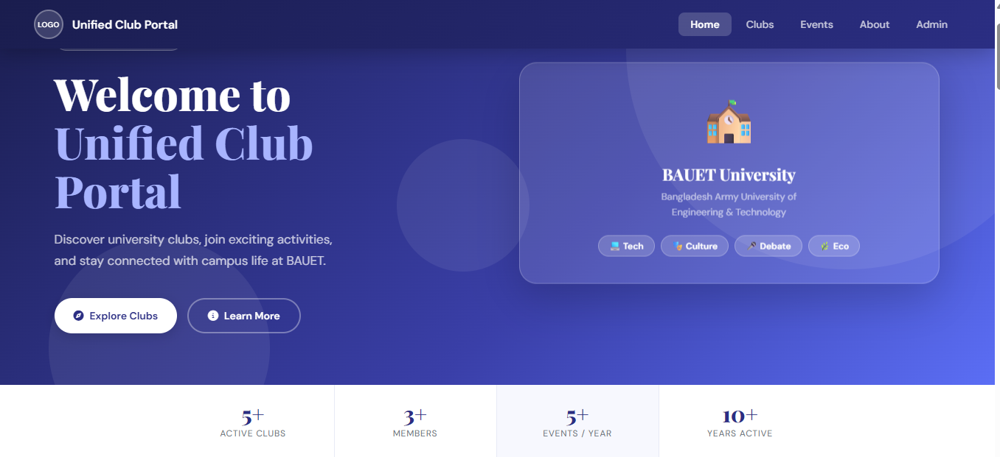
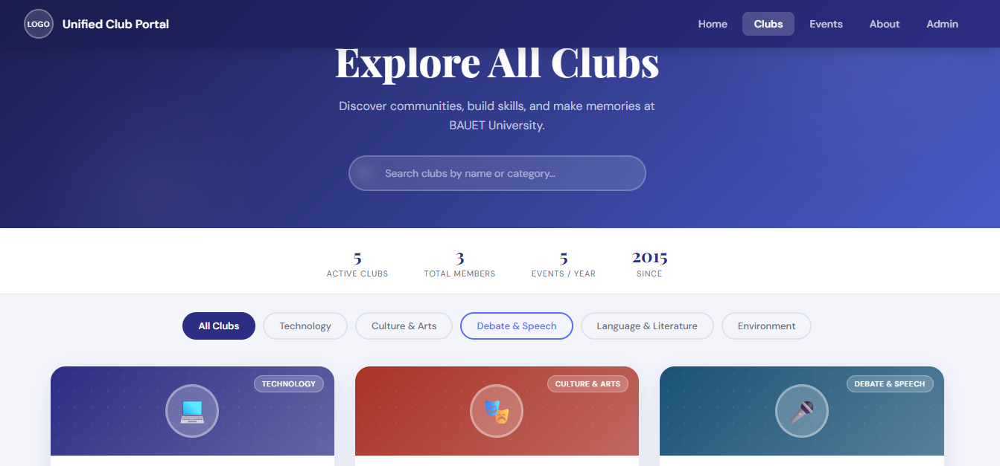

# 🎓 Unified Club Portal


A **web-based platform** that brings all university clubs into one centralized digital system where students can easily access club information, register for clubs, and stay updated with events and announcements.

This system simplifies **club management, communication, and event organization** between students and club administrators

---

## 📌 Overview

University clubs are an important part of campus life, but managing club information, announcements, and registrations manually can be difficult.

The **Unified Club Portal** provides a centralized platform where:

- Students can explore clubs

- Register for clubs

- Receive event updates and notifications

- View upcoming events and deadlines

Meanwhile, **administrators manage clubs, events, announcements, and registrations** through a dedicated admin panel

---

## ✨ Key Features

### 👨‍🎓 Student Panel

Students can:

- Browse all university clubs  
- View club details and activities  
- Register for clubs 
- Online event registration 
- Download registration forms  
- Receive notifications and announcements  
- View upcoming events and deadlines  

---

### 🛠️ Admin Panel

Admins can:

- Add, edit, and delete clubs  
- Post notifications and announcements  
- Create and manage events  
- Set registration deadlines  
- Manage student registrations  
- Upload club documents  

---

## 🏗️ Project Architecture

```
Unified-Club-Portal/

│
├── client/                 # Frontend
│   ├── html/
│   │   ├── index.html
│   │   ├── clubs.html
│   │   └── events.html
│   │
│   ├── css/
│   │   └── style.css
│   │
│   ├── js/
│   │   └── script.js
│   │
│   └── images/
│
├── server/                 # Node.js Backend
│   ├── controllers/
│   ├── routes/
│   ├── models/
│   ├── middleware/
│   ├── config/
│   └── server.js
│
├── database/
│   └── mongodb.js
│
├── admin-panel/
├── student-panel/
│
├── docs/
│   └── system-design.md
│
├── TODO.md
├── .gitignore
└── README.md
```

---

## 🛠️ Technology Stack

### Frontend

- HTML5  
- CSS3  
- JavaScript  

### Backend

- Node.js  
- Express.js  

### Database

- MongoDB  

### Tools

- Git  
- GitHub  
- VS Code  

---

## 🚀 Getting Started

### Prerequisites

Before running the project make sure you have installed:
- A modern web browser
- Local server (VS Code Live Server)
- Node.js  
- MongoDB  
- Git  
 
---

## ⚙️ Installation

### 1. Clone the Repository

```bash
git clone https://github.com/rafikun2523-er/club-integrating-website.git
```

### 2. Navigate to Project Folder

```bash
cd club-integrating-website
```

### 3. Install Dependencies

```bash
npm install
```

### 4. Run Backend Server

```bash
node server/server.js
```

or

```bash
npm run dev
```

---

## 👥 User Roles

### 👨‍🎓 Student

Students can:

- View clubs  
- Register for clubs  
- Receive notifications  
- View upcoming events  

### 🛠️ Admin

Admins can:

- Manage clubs  
- Post announcements  
- Manage events  
- Set deadlines  
- Manage student registrations  

---

## 📸 Screenshots


### 🏠 Home Page

The Home Page is the main landing page of the Unified Club Portal.  
From here students can explore different university clubs and about our rules.

### Features of the Home Page

- Explore university club list
- Shows instant notification
- Highlights upcoming events
- Provides navigation to student panel and admin panel
- Quick access to club registration

### Home Page Screenshot



### 🏫 Club Page

The Club Page displays detailed information about each university club.  
Students can learn about the club activities, view events, and apply to join the club.

### Club Page Features

- Shows club name and description
- Displays club events and activities
- Shows club announcements
- Provides club registration option
- Shows club members or executive panel

### Club Page Screenshot




### Admin Dashboard

- Show admin dashboard
- Manage clubs & events(add/edit/delete)
- Manage student members
- Bulk member import via CSV
- Event calendar view


---

## 📅 TODO Example

```
✔ Club listing system
✔ Student registration system
✔ Admin notification system
⬜ Email notification system
⬜ Event reminder system
⬜ Mobile responsive UI
⬜ Analytics dashboard
```

---

## 📄 .gitignore Example

```
node_modules/
.env
.vscode/
dist/
build/
*.log
```

---

## 📈 Future Improvements

- Email notification system  
- Event reminder system  
- Mobile responsive design  
- Club activity analytics  
   

---

## 👨‍💻 Author

**Rafikun Nesa Hena (Project Manager)**


**Tahsina Tasnim Disha**

**Nishat Salsabil Silvi**

**Nazia Rahman Arobe**

## University Project  
🎓Unified Club Portal 

---

## ⭐ Support

If you like this project, please give it a **star ⭐ on GitHub**.